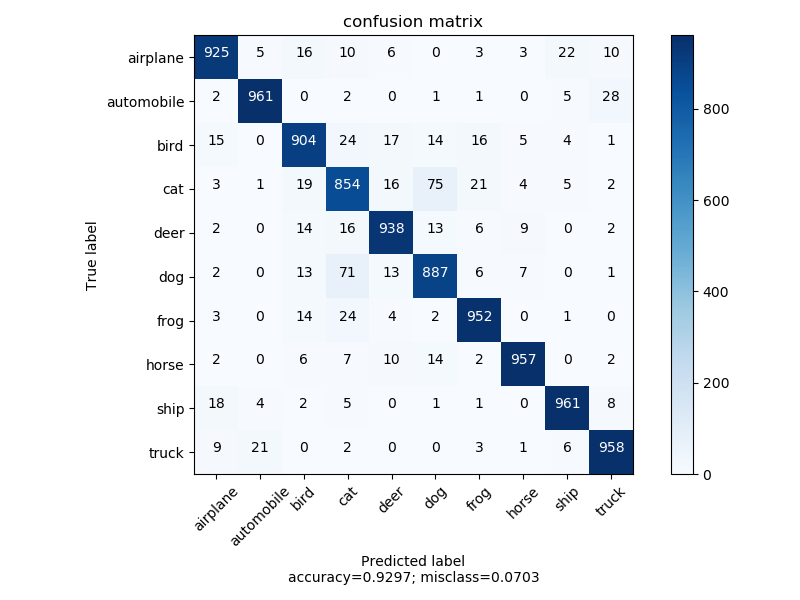
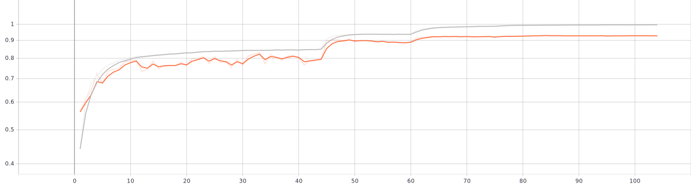

# PyTorch Classification
 Minimal and clean training and evaluation codes for baseline performances.
 
## Code Features
* Learning Rate Scheduling is implemented with torch.optim.lr_Scheduler  
* Tensorboard visualization is added
* Early stopping is implemented
* Best parameters for validation accuracy is saved
* Confusion matrix for validation set is generated
* Optuna HParam search framework is used to find best parameters

### Training and Validation Sets Accuracies for ResNet18

